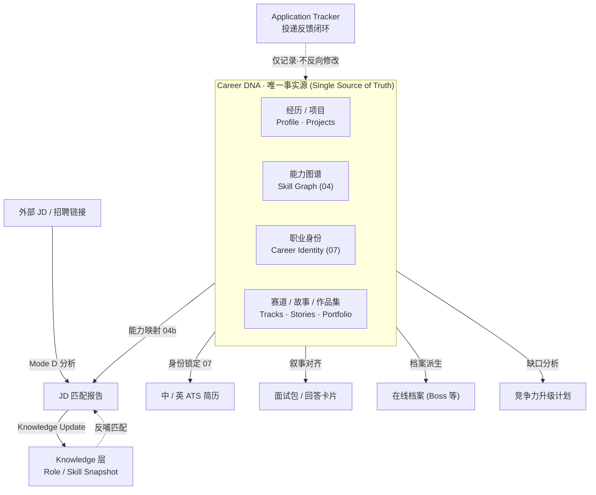
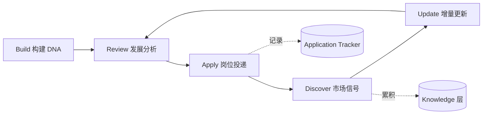
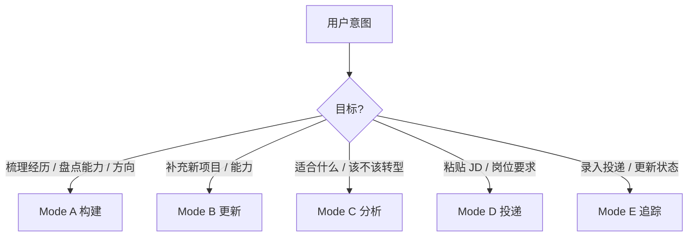

# Career Manager — AI 职业经理人

> 把你的 AI 助手变成私人 Career Manager：以 **Career DNA（职业基因库）** 为唯一事实源，持续建设、管理、升级你的职业资产，而不是每次看到 JD 都从零重写简历。

[](LICENSE)
[](https://github.com/lamhoying/career-manager/releases)
[](#跨平台兼容性)

---

## 目录

- [为什么需要它](#为什么需要它)
- [这是什么：Career DNA](#这是什么career-dna)
- [系统架构](#系统架构)
- [四层架构](#四层架构)
- [核心原则](#核心原则)
- [五大工作模式](#五大工作模式)
- [关键能力](#关键能力)
- [触发场景](#触发场景)
- [跨平台兼容性](#跨平台兼容性)
- [安装方式](#安装方式)
- [目录结构](#目录结构)
- [首次使用](#首次使用)
- [版本与更新](#版本与更新)
- [License](#license)

---

## 为什么需要它

大多数人的职业资产是**碎片化、不可复用**的：

- 每次看到心仪 JD，就在旧简历上东改西改，改完就忘；
- 投递十几次，每段经历被讲成十几个互相矛盾的版本；
- 想转行 / 晋升时，说不清自己「到底会什么、凭什么适合」；
- 面试被追问细节就露怯，因为故事从没被认真沉淀过。

Career Manager 不帮你「美化一份简历」，而是帮你建立一个**可持续演进的职业资产系统**。简历、面试材料、岗位匹配报告，都从同一个事实源（Career DNA）自动派生——你只维护一次，到处复用。

---

## 这是什么：Career DNA

Career Manager 是一个 **AI 助手技能包（Skill）**，可运行于 WorkBuddy、Claude Code、OpenAI Codex、Cursor 等多种支持自定义指令 / 技能的 agent 环境。它围绕一个核心思想设计：

> **Career DNA = 你职业经历、能力、项目、故事与成长轨迹的唯一事实源（Single Source of Truth）。简历只是 Career DNA 的一种输出形式。**

传统做法是「每次看到 JD 就重写一遍简历」，信息是碎片化的、不可复用的。本技能把职业资产沉淀成一个可持续演进的系统——你真实做过的事写入 Career DNA 一次，其余产物全部由此自动派生：

```
你真实做过的事 ──写入──▶ Career DNA（事实源 / SSOT）
                            │
            ┌───────────────┼───────────────┐
            ▼               ▼               ▼
       中文 / 英文简历    JD 匹配报告    面试包 / 回答卡片
       在线档案(Boss等)   缺口分析/补强    转岗可行性评估
```

---

## 系统架构

本技能把「个人资产 / 市场情报 / 单次产物 / 投递追踪」拆分为四条清晰边界。Career DNA 作为唯一事实源，向上派生所有投递物料；外部 JD 经分析后沉淀进 Knowledge 层反哺后续匹配，投递结果则独立记录在 Application Tracker——形成「建设 → 分析 → 投递 → 反馈」的闭环。



职业资产随使用持续演进，市场信号与投递反馈各自累积、互不污染：



---

## 四层架构

v1.3 起职责收敛，v2.0 进一步扩展为清晰的四层，彻底分离「个人资产 / 市场情报 / 单次产物 / 投递追踪」：

| 层 | 定位 | 回答的问题 | 内容 | 更新来源 |
|----|------|-----------|------|----------|
| **Career DNA**（个人资产层） | 你的唯一事实源 | 我做过什么、为什么适合某方向 | 经历 / 能力 / 项目 / 故事 / Career Track | 你提供 |
| **Knowledge**（市场知识层） | 外部市场情报 | 市场需要什么、趋势是什么 | Role Snapshot、Skill Domain Snapshot | JD 分析累积 |
| **Resume Outputs**（投递产物层） | 单次 JD 临时产物 | 这次 JD 我准备了什么 | 匹配报告 / 简历 / 面试包 | 每次 JD 生成 |
| **Application Tracker**（投递追踪层） | 投递反馈记录 | 我投了以后发生了什么 | 投递主表 / 状态定义 / Case 档案 | 用户手动录入 |

关键规则：Career DNA 是**个人资产**，Knowledge 是**市场资产**，Resume Outputs 是**临时产物**，Application Tracker 是**反馈记录**；Career Track 回答「你适合什么」，Role Snapshot 回答「市场要什么」——两者不再重叠。每次投递单建子目录（`{日期}-{公司}-{岗位}/`），不覆盖历史记录。

---

## 核心原则

1. **Career DNA First（资产优先）**：Career DNA 永远优先于简历。先确保职业资产充足，再生成简历，不要一上来就优化排版。
2. **Evidence Driven（证据驱动）**：所有能力必须有证据支持。禁止虚构经历、夸大职责、编造项目。每项能力必须能回答：来自哪个项目？有什么证据？面试官追问时如何证明？
3. **Build Before Optimize（先建库再优化）**：资产不足时先补充，再产出。
4. **Career DNA Evolves（持续成长）**：不是一次性工程。每次新项目、新岗位、新 JD 都可能更新 DNA。
5. **Unknown → Backlog（未知进待补充池）**：信息不足不猜测，写入 Question Backlog，等待未来补充；禁止长时间连续追问。
6. **Knowledge Accumulates（知识累积）**：每次 JD 分析都提取市场信号写入 Knowledge Layer，随投递次数增长，反哺后续匹配。

---

## 五大工作模式

技能根据用户目标自动路由（先检查当前目录是否存在 `career-dna/`，再决定模式）：



| 模式 | 名称 | 触发场景 | 产出 |
|------|------|----------|------|
| **A** | **Career DNA 构建** | 首次梳理经历 / 盘点能力 / 分析职业方向 | 完整个人职业基因库（`career-dna/`） |
| **B** | **职业资产更新** | 补充新项目 / 新能力 / 回答 Backlog 问题 | DNA 增量更新，不重复建设 |
| **C** | **职业发展分析** | 我适合什么岗位 / 该不该转型 / 竞争力在哪 / 缺什么 | 能力盘点、成长路径、转型可行性 |
| **D** | **岗位投递** | 粘贴 JD / 招聘链接 / 岗位要求 | 匹配报告、中英简历、面试包、缺口分析与补强路线（两阶段门控，默认停在决策门） |
| **E** | **投递追踪** | 录入投递 / 更新面试状态 / 记录反馈 / 看统计 | 投递主表、状态流转、Case 档案、转化看板 |

---

## 关键能力

### 匹配与决策
- **可解释匹配引擎（Explainable Match Engine）**：JD 匹配度按 4 维量化（硬性要求 40% / 经验 30% / 能力映射 20% / 行业 10%），并给出**匹配置信度拆解**（Count Quality / Quality / Consistency / Recency）与证据来源，而非黑盒打分。
- **职业决策引擎（Career Decision Engine）**：用 Evidence Distance（D0–D4）、Role Authenticity（A–D）、Recruiter Risk Funnel 与 Decision Score，把「该不该投这个岗位」变成可解释的判断。
- **能力迁移翻译（Capability Translation）**：把经历映射到目标岗位要求，区分 Direct / Adjacent / Missing 三类，禁止编造不存在的匹配。

### 证据体系
- **证据强度（Evidence Strength）**：每条证据按 5 维评分（Ownership / Scope / Impact / Recency / Relevance），总分映射到 Strength 0–5，决定它写进主简历、放进面试包，还是仅作内部参考——杜绝「什么都敢往简历上写」。
- **简历 / 面试证据管线（ATS Evidence Pipeline，v2.6–v2.7）**：把「重写整份简历」拆成可审计步骤——先用 `07` 锁定职业身份、用 `04b` 做能力映射；每条经历经 Experience Reframing 拆分为 Profile Reframing（在线档案）与 ATS Reframing（简历，受 E01–E04 证据保全规则约束）；最终由 Step 9.1 Resume QA Layer（QA-1 身份漂移 / QA-2 能力缺失 / QA-3 过度包装 / QA-4 身份回退）把关。

### 身份与能力
- **职业身份重构（Career Identity Reframe，v2.5）**：`07_career_identity.md` 升级为 5 层 Identity-First 结构，明确「起点经历是能力形成路径，不是身份」；Pipeline 新增 Identity Resolution 步骤锁定身份，配合 R01–R04 硬规则。
- **可迁移能力映射（Transferable Capability Mapping，v2.3）**：在 Skill Graph 与 Role Snapshot 之间插入能力转换层（`04b_transferable_capabilities.md`），回答「同一个能力在不同岗位应如何不同表达」。
- **在线职业档案派生**：从 Career DNA 自动生成 Boss / 猎聘等平台在线简历文案（`11_online_profile.md`），由 Profile Positioning Engine（Primary/Secondary/Adjacent Track + Universal Strengths）驱动。

### 内容生成
- **作品集发现与生成（Portfolio Discovery & Output，v2.1）**：从 Career DNA 自动发现、验证并生成作品集案例（8 字段结构化），投递时按 JD 推荐 Top 3 最佳案例。
- **岗位沟通产物生成（Outreach / Boss Greeting，v1.6）**：由匹配报告驱动的 JD 级即时沟通文案——按岗位与匹配度选打招呼目标（建联 / 证明价值 / 化解顾虑 / 激发好奇），从 Strength≥4 证据池按规则分层路由，四平台（Boss / 猎聘 / 邮件 / LinkedIn）各自生成不同目标版本，并附 Why / Tone / Do Not Say。

### 闭环与追踪
- **投递追踪系统（Application Tracker，v2.0）**：v1.x 解决「我该怎么投」，v2.0 解决「我投了以后发生了什么」。录入投递、更新状态（Stage 0 Planned → Stage 7 Offer / Stage 8 Rejected）、登记反馈，查看转化与 Offer 率看板——形成完整闭环。

---

## 触发场景（对话里这样开口）

- 「帮我梳理一下这几年的工作经历」
- 「把我刚做完的 XX 项目加进职业档案」
- 「分析一下我适合往游戏技术 PM 方向转吗」
- 「这是一段 JD，帮我匹配并生成中英文简历和面试准备」
- 「我投这个岗位还差什么，给我一份补强计划」

只要在对话中提到「职业 / 简历 / 能力盘点 / 岗位匹配 / 面试准备」相关意图，技能即会被触发。

---

## 跨平台兼容性

本技能只依赖两样东西，因此可在任意 AI 助手中复用：

- **纯文本指令**：`SKILL.md` + `references/*.md` 都是 Markdown，不含任何平台专属 API 调用。
- **标准库 Python**：`scripts/*.py` 仅使用 `os / sys / re / pathlib / shutil / datetime` 等 Python 标准库，可在任意装有 Python 3 的环境直接运行。

没有写死的平台私有 SDK，没有平台专属路径依赖。各 agent 的差异只在于「如何加载这段指令」和「如何触发」，技能的内容本身完全通用。

---

## 安装方式

### 方式一：WorkBuddy

```bash
git clone ⟨本仓库地址⟩ career-manager
cp -R career-manager ~/.workbuddy/skills/career-manager
```

重启 WorkBuddy 即可在任意对话中触发。

> 路径说明：
> - **macOS**：`~/.workbuddy/skills/career-manager/`
> - **Windows / Linux**：`%USERPROFILE%/.workbuddy/skills/career-manager/`（或 `~/.workbuddy/skills/career-manager/`）

### 方式二：Claude Code

Claude Code 同样以 `SKILL.md` 的 `name` / `description` 作为技能声明，可直接识别本技能包：

```bash
git clone ⟨本仓库地址⟩ career-manager
cp -R career-manager ~/.claude/skills/career-manager    # 用户级
# 或放到项目级：⟨你的项目⟩/.claude/skills/career-manager
```

### 方式三：OpenAI Codex / 通用 agent

Codex 等没有原生的「技能包」概念，两种用法皆可：

1. 把 `SKILL.md` 的核心流程与 `scripts/` 用法写入你的 `AGENTS.md`（或 system prompt），让 agent 在对话中按指令执行；
2. 直接在对话里粘贴 `SKILL.md` 内容作为上下文，脚本通过其 shell 工具运行。

### 方式四：Cursor / Windsurf / Cline

将 `SKILL.md` 转换为对应工具的 rule 文件（如 `.cursor/rules/career-manager.mdc`）或自定义 command，脚本照常通过其终端运行。

### 方式五：从 Release 安装

在仓库的 **Releases** 页面下载 `career-manager.zip`，解压后将 `career-manager/` 文件夹复制到对应 agent 的技能目录即可（各 agent 的目录见上方各方式）。

---

## 目录结构

<details>
<summary>展开查看完整目录树（Skill 包结构）</summary>

```
career-manager/
├── SKILL.md                      # 技能入口与核心指令（必含）
├── LICENSE                       # MIT 许可证
├── README.md                     # 本文件
├── scripts/                      # 可执行脚本（确定性逻辑，仅标准库）
│   ├── init_career_dna.py        # 初始化 Career DNA 目录结构
│   ├── completeness_checker.py   # 完整度评分检查
│   ├── validate_career_dna.py    # Career DNA 写入闸门（manifest 校验）
│   └── export_resume.py          # 投递定稿导出（HTML→PDF/DOCX）
├── references/                   # 按需加载的详细参考文档
│   ├── career_dna_structure.md   # DNA 结构与字段说明
│   ├── mode_a_build.md           # 模式 A 流程
│   ├── mode_b_update.md          # 模式 B 流程
│   ├── mode_c_review.md          # 模式 C 流程
│   ├── mode_d_job_application.md # 模式 D 流程
│   ├── mode_e_application_tracker.md # 模式 E 流程（投递追踪）
│   ├── online_profile_generation.md # 在线档案生成（Profile Positioning Engine）
│   ├── transferable_capability_generation.md # 可迁移能力生成（v2.3）
│   ├── output_contracts.md       # 产物格式契约
│   ├── question_backlog.md       # 待澄清问题库
│   ├── targeted_discovery.md     # 定向挖掘提问库
│   └── pack_templates/           # 01-08 产物版式唯一定义源
└── assets/templates/             # 输出用模板（不进 context）
    ├── career-dna/               # DNA 各模块模板（01~13）
    │   ├── 01_profile.md         #   个人职业档案
    │   ├── 02_timeline.md        #   职业发展轨迹
    │   ├── 03_projects.md        #   项目资产库
    │   ├── 04_skill_graph.md     #   能力图谱（Domain/Confidence/Evidence）
    │   ├── 04b_transferable_capabilities.md # 可迁移能力映射（v2.3 派生资产）
    │   ├── 05_story_bank.md      #   面试故事库
    │   ├── 06_failure_story.md   #   失败案例库
    │   ├── 07_career_identity.md #   职业身份库（v2.5 Identity-First 5 层）
    │   ├── 08_question_backlog.md#   待补充问题库
    │   ├── 09_completeness_report.md # 完整度报告
    │   ├── 10_career_tracks/     #   职业赛道库（每赛道一文件）
    │   ├── 11_online_profile.md  #   在线职业档案（派生资产）
    │   ├── 12_portfolio_candidates.md # 作品集候选池（v2.1 派生资产）
    │   └── 13_interview_narrative_strategy.md # 面试叙事战略手册（面试表达 SSOT）
    ├── knowledge/                # 市场知识库模板
    │   ├── role_snapshot.md      #   岗位快照
    │   └── skill_snapshot.md     #   能力域快照
    ├── application-tracker/      # 投递追踪库模板（v2.0）
    │   ├── 01_application_index.md   # 全量投递主表
    │   ├── 02_status_definitions.md  # 统一状态定义
    │   └── archives/README.md        # Case 档案（按需建档）
    └── resume-outputs/           # 投递产物模板
        ├── 01_jd_match_report.md #   岗位匹配报告
        ├── 02_resume_cn.md       #   中文 ATS 简历
        ├── 03_resume_en.md       #   英文 ATS 简历
        ├── 04_interview_pack.md  #   面试准备包
        ├── 05_answer_cards.md    #   回答卡片库
        ├── 06_upgrade_plan.md     #   竞争力升级计划
        ├── 07_boss_greeting.md   #   Boss 直聘 / 平台打招呼语
        ├── XX_gap_analysis.md     #   能力差距分析
        ├── XX_transition_resume_cn.md   # 转岗中文简历
        ├── XX_transition_resume_en.md   # 转岗英文简历
        ├── XX_transition_feasibility.md # 转岗可行性评估
        └── XX_portfolio.md        #   作品集案例（v2.1 派生资产）
```

</details>

> **隐私说明**：本技能只包含「指令 + 空白模板 + 脚本」，不含任何个人职业数据。你的真实 Career DNA、Knowledge、Resume Outputs 会在你本地工作区生成，不会随技能包外泄。

---

## 首次使用

1. 在任意支持的 AI 助手中开启一个新任务，说：「帮我构建 Career DNA」。
2. 技能会调用 `init_career_dna.py` 在当前工作区生成 `career-dna/`、`knowledge/`、`resume-outputs/` 目录。
3. 按引导逐步填写经历、项目、能力、故事（证据驱动，禁止虚构）。
4. 之后每次有新材料，用模式 B 增量更新；要投岗位时用模式 D，自动生成分层投递物料。

---

## 兼容性说明

- 从本仓库克隆的版本 **不含** `agent_created` 标记（那是 WorkBuddy 专属的可管理标记，其他 agent 会忽略）。若你只用 WorkBuddy 并希望用内置 Skill 管理功能编辑此技能，可在 `SKILL.md` frontmatter 加回一行 `agent_created: true`。
- 所有 `references/*.md` 与 `assets/templates/*.md` 均为纯 Markdown，可直接被任意 agent 读取。
- 本仓库不含任何写死的绝对路径（除各 agent 的可选技能安装目录 `skills/` 外），无平台私有依赖。

---

## 版本与更新

完整逐版本变更记录见 [GitHub Release notes](https://github.com/lamhoying/career-manager/releases)。当前版本 **v2.21.0**。

### 版本里程碑

- **v2.21.0**：身份层（07）重构——Layer 2 定位与赛道映射拆分为受控字段（`Track` / `Positioning` 语义分离），新增方向冲突探针与 Layer 5 条件化收录机制，进一步收紧身份→能力→证据推理链的稳定性与可治理性。
- **v2.19.0**：发布包不再内含内部变更日志（CHANGELOG），改为在 GitHub Release notes 提供精炼公开摘要；完成多轮架构治理与模板中性化——身份（07）/ 能力（04b）/ 证据（03）三层推理链收敛、面试表达层 SSOT（13）、Mode D 两阶段门控与 G5 冲突检测；系统性去除模板与参考文档中的个人化痕迹，使 skill 默认通用可复用。
- **v2.7.1**：新增 Step 9.1 Resume QA Layer（QA-1~QA-4 四检）+ Step 9.0 逐经历重构循环 + Step 8.12 叙事强度；并清理模板 / 参考文件中的 PII 痕迹。
- **v2.6**：Mode D 集成 07+04b（Step 4.5 身份锁定 + 能力驱动简历生成）；随后 v2.6.2 引入 E01–E04 证据保全规则，v2.6.4 确立 ATS 三层输出结构。
- **v2.5**：职业身份重构——`07_career_identity.md` 5 层 Identity-First 结构 + Identity Resolution + R01–R04 硬规则。
- **v2.3**：可迁移能力映射——新增 `04b_transferable_capabilities.md` 与生成规则，Online Profile 接入能力转换层。
- **v2.2**：在线档案重构——`11_online_profile.md` 严格映射 Boss 字段 + Profile Positioning Engine。
- **v2.1**：作品集发现与生成——新增 `12_portfolio_candidates.md` + `XX_portfolio.md`，Mode A/B/D 全链路联动。
- **v2.0**：投递追踪系统——新增 `application-tracker/` 层与 **Mode E**，形成「分析→决策→投递→反馈」闭环。

> 更早版本（v1.x 系列的匹配引擎、证据强度、打招呼语等人味化能力）的逐条记录，请查阅上述 GitHub Release notes。

---

## License

[MIT](LICENSE) © 2026 The Career Manager Authors
